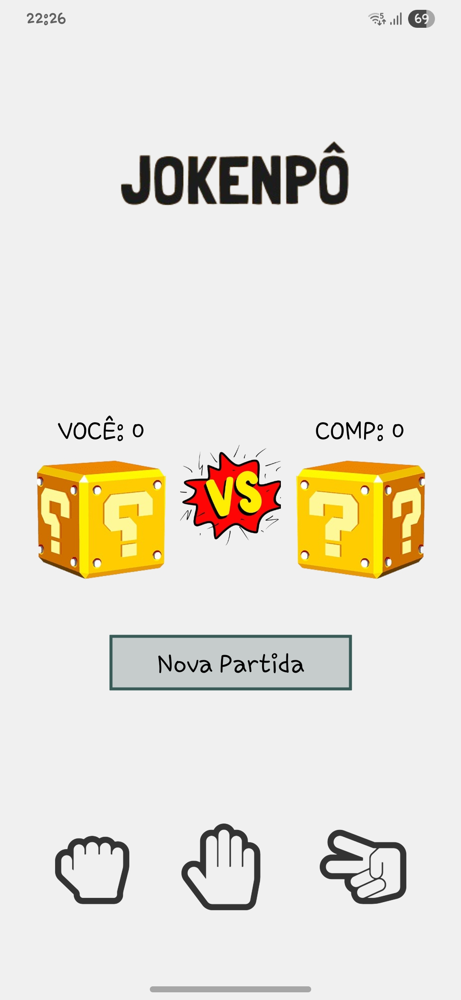
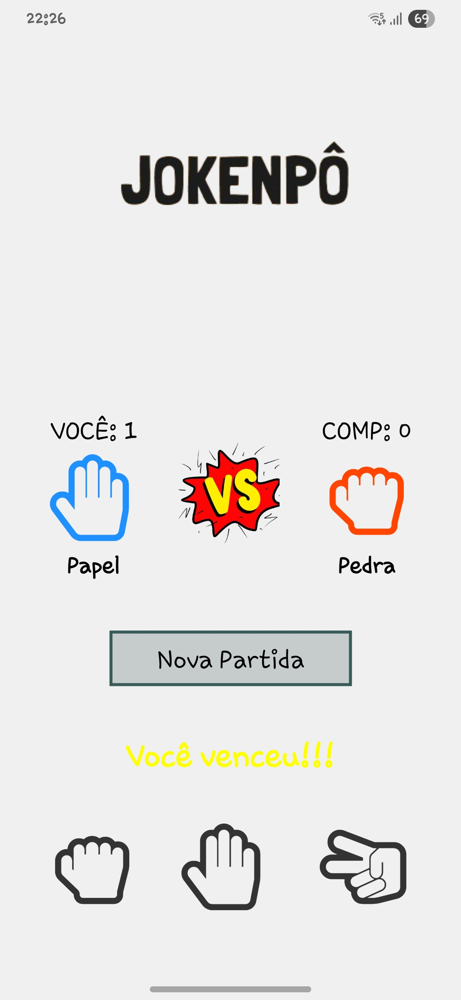
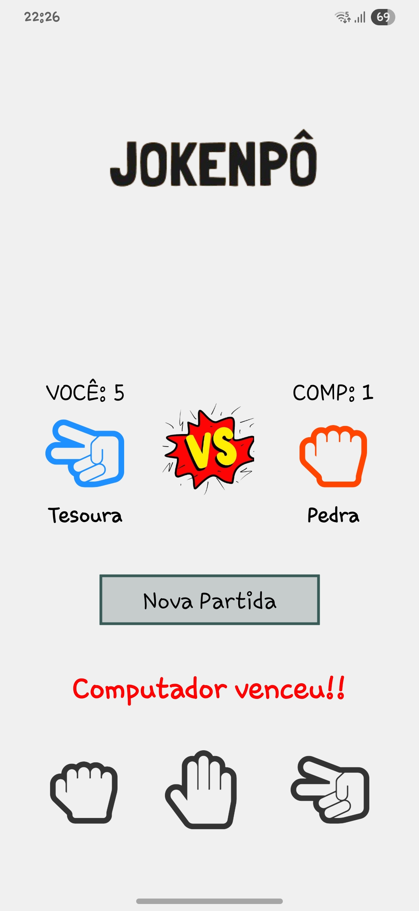

# Jokepô 🎮✊✋✌️

Um jogo simples de **Pedra, Papel e Tesoura** desenvolvido em **React**.  
O projeto foi feito para praticar conceitos de **componentização**, **hooks** e **estilização**.

---

## 🚀 Tecnologias
- [React](https://reactjs.org/)
- [JavaScript](https://developer.mozilla.org/pt-BR/docs/Web/JavaScript)
- [CSS](https://developer.mozilla.org/pt-BR/docs/Web/CSS)

---

## 📷 Prints do Projeto

<p align="center">
  
  
  
</p>
---

## ⚙️ Como rodar o projeto

Requisitos: Node.Js (última versão da LTS), Vscode (Visualização e Edição do código), Expo go (Observa pelo dispositivo mobile, Opcional)

```bash
# Clone o repositório
git clone https://github.com/seu-usuario/jokepo-react.git

# Entre na pasta
cd jokepo-react

# Instale as dependências
npm i

# Rode o projeto
npm start
